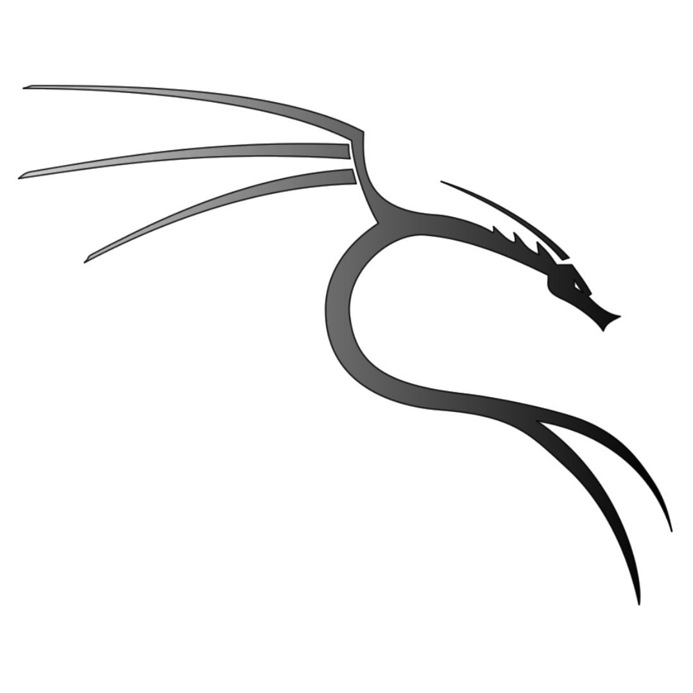

## SOBRE MÍ

 👋 Mi trayectoria profesional comenzó en Venezuela, donde estudié y ejercí el 𝐁𝐢𝐨𝐚𝐧𝐚́𝐥𝐢𝐬𝐢𝐬 en la Universidad de Los Andes. Posteriormente, obtuve una beca para realizar un doctorado en 𝐁𝐢𝐨𝐥𝐨𝐠𝐢́𝐚 𝐌𝐨𝐥𝐞𝐜𝐮𝐥𝐚𝐫 en la Universidad de Zaragoza, España. Durante mi formación doctoral, me especialicé en la investigación sobre regulación y expresión génica.

Tras un período de pausa en mi carrera, decidí reinventarme y ampliar mis horizontes. Estudié 𝐃𝐞𝐬𝐚𝐫𝐫𝐨𝐥𝐥𝐨 𝐝𝐞 𝐀𝐩𝐥𝐢𝐜𝐚𝐜𝐢𝐨𝐧𝐞𝐬 𝐌𝐮𝐥𝐭𝐢𝐩𝐥𝐚𝐭𝐚𝐟𝐨𝐫𝐦𝐚 (DAM) en Linkia (Stucom), donde adquirí habilidades en programación. Además, me formé en desarrollo web con Keepcoding, dominando tecnologías como HTML, CSS, Js y más. De manera autodidacta, he ampliado mis conocimientos en múltiples lenguajes de programación, incluyendo Java, C# y Python.

Consciente de la creciente importancia de la ciberseguridad, también me especialicé en este campo. Mi formación en hacking ético, hacking forense y ciberinteligencia la he desarrollado con Upgrade Hub. Actualmente, sigo profundizando mis conocimientos en Java con la gente de Hack a Boss.

Hoy en día, me desempeño como 𝐚𝐧𝐚𝐥𝐢𝐬𝐭𝐚 𝐝𝐞 𝐩𝐫𝐮𝐞𝐛𝐚𝐬 de software en Entelgy, contratada a través de la Fundación Goodjob.

## Herramientas y lenguajes de programación:

     
     
         
     
     
    
        
       
    

